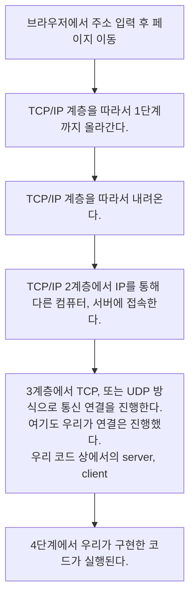

```mermaid
flowchart
    A[브라우저에서 주소 입력 후 페이지 이동] --> B
    B[TCP/IP 계층을 따라서 1단계까지 올라간다.] --> C
    C[TCP/IP 계층을 따라서 내려온다.] --> D
    D[TCP/IP 2계층에서 IP를 통해 다른 컴퓨터, 서버에 접속한다.] --> E
    E[3계층에서 TCP, 또는 UDP 방식으로 통신 연결을 진행한다.\n여기도 우리가 연결은 진행했다.\n우리 코드 상에서의 server, client] --> F
    F[4단계에서 우리가 구현한 코드가 실행된다.]
```
