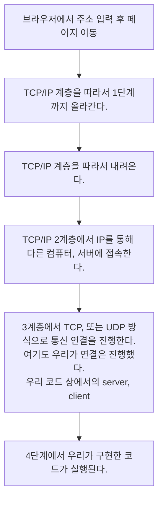
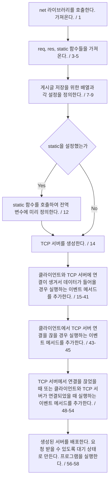
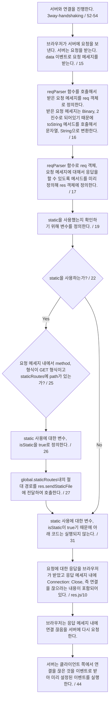
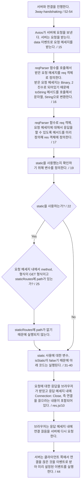
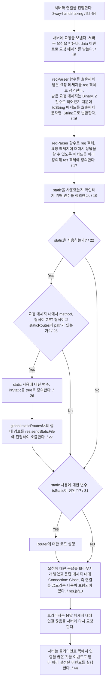

# TCP 상에서의 흐름

```mermaid
flowchart
    A[브라우저에서 주소 입력 후 페이지 이동] --> B
    B[TCP/IP 계층을 따라서 1단계까지 올라간다.] --> C
    C[TCP/IP 계층을 따라서 내려온다.] --> D
    D[TCP/IP 2계층에서 IP를 통해 다른 컴퓨터, 서버에 접속한다.] --> E
    E[3계층에서 TCP, 또는 UDP 방식으로 통신 연결을 진행한다.\n여기도 우리가 연결은 진행했다.\n우리 코드 상에서의 server, client] --> F
    F[4단계에서 우리가 구현한 코드가 실행된다.]
```

---

# 구현된 코드 상에서 서버 배포의 흐름

```mermaid
flowchart
    A[net 라이브러리를 호출한다. 가져온다. / 1] --> B
    B[req, res, static 함수들을 가져온다. / 3-5] --> C
    C[게시글 저장을 위한 배열과 각 설정을 정의한다. / 7-9] --> D
    D{static을 설정했는가} -->|Yes| J
    J[static 함수를 호출하여 전역 변수에 미리 정의한다. / 12] --> E
    D --> |No| E
    E[TCP 서버를 생성한다. / 14] --> F
    F[클라이언트와 TCP 서버에 연결이 생겨서 데이터가 들어올 경우 실행하는 이벤트 메서드를 추가한다. / 15-41] --> G
    G[클라이언트에서 TCP 서버 연결을 끊을 경우 실행하는 이벤트 메서드를 추가한다. / 43-45] --> H
    H[TCP 서버에서 연결을 끊었을 때 또는 클라이언트와 TCP 서버가 연결되었을 때 실행하는 이벤트 메서드를 추가한다. / 48-54] --> I
    I[생성된 서버를 배포한다. 요청 받을 수 있도록 대기 상태로 만든다. 프로그램을 실행한다. / 56-58]
```

# 브라우저에서 접속했을 때의 흐름

```mermaid
    flowchart
    A[서버와 연결을 진행한다. 3way-handshaking / 52-54]
    B[브라우저가 서버에 요청을 보낸다. 서버는 요청을 받는다. data 이벤트로 요청 메세지를 받는다. / 15]
    C[reqParser 함수를 호출해서 받은 요청 메세지를 req 객체로 정의한다.\n받은 요청 메세지는 Binary, 2진수로 되어있기 때문에 toString 메서드를 호출해서 문자열, String으로 변환한다. / 16]
    D[reqParser 함수로 req 객체, 요청 메세지에 대해서 응답을 할 수 있도록 메서드를 미리 정의해 res 객체에 정의한다. / 17]
    E[static을 사용했는지 확인하기 위해 변수를 정의한다. / 19]
    F{static을 사용하는가? / 22}
    F --> |Yes| F1 --> F2 --> F3 --> G
    F --> |No| G
    F1{요청 메세지 내에서 method, 형식이 GET 형식이고\nstaticRoutes에 path가 있는가? / 25}
    F2[static 사용에 대한 변수, isStatic을 true로 정의한다. / 26]
    F3[global.staticRoutes내의 절대 경로를 res.sendStaticFile에 전달하여 호출한다. / 27]
    G[static 사용에 대한 변수, isStatic이 true기 때문에 아래 코드는 실행되지 않는다. / 31]
    H[요청에 대한 응답을 브라우저가 받았고 응답 메세지 내에 Connection: Close, 즉 연결을 끊으라는 내용이 포함되어 있다. / res.js/10]
    I[브라우저는 응답 메세지 내에 연결 끊음을 서버에 다시 요청한다.]
    J[서버는 클라이언트 쪽에서 연결을 끊은 것을 이벤트로 받아 미리 설정된 이벤트를 실행한다. / 44]

    A-->B-->C-->D-->E-->F
    G-->H-->I-->J

```

# AXIOS 요청에 대한 흐름

```mermaid
    flowchart
    A[서버와 연결을 진행한다. 3way-handshaking / 52-54]
    B[Axios가 서버에 요청을 보낸다. 서버는 요청을 받는다. data 이벤트로 요청 메세지를 받는다. / 15]
    C[reqParser 함수를 호출해서 받은 요청 메세지를 req 객체로 정의한다.\n받은 요청 메세지는 Binary, 2진수로 되어있기 때문에 toString 메서드를 호출해서 문자열, String으로 변환한다. / 16]
    D[reqParser 함수로 req 객체, 요청 메세지에 대해서 응답을 할 수 있도록 메서드를 미리 정의해 res 객체에 정의한다. / 17]
    E[static을 사용했는지 확인하기 위해 변수를 정의한다. / 19]
    F{static을 사용하는가? / 22}
    F --> |Yes| F1 --> F2 --> G
    F --> |No| G
    F1{요청 메세지 내에서 method, 형식이 GET 형식이고\nstaticRoutes에 path가 있는가? / 25}
    F2[staticRoutes에 path가 없기 때문에 실행되지 않는다.]
    G[static 사용에 대한 변수, isStatic이 false기 때문에 아래 코드는 실행된다. / 31-40]
    H[요청에 대한 응답을 브라우저가 받았고 응답 메세지 내에 Connection: Close, 즉 연결을 끊으라는 내용이 포함되어 있다. / res.js/10]
    I[브라우저는 응답 메세지 내에 연결 끊음을 서버에 다시 요청한다.]
    J[서버는 클라이언트 쪽에서 연결을 끊은 것을 이벤트로 받아 미리 설정된 이벤트를 실행한다. / 44]

    A-->B-->C-->D-->E-->F
    G-->H-->I-->J

```

# 요청에 대한 흐름

```mermaid
    flowchart
    A[서버와 연결을 진행한다. 3way-handshaking / 52-54]
    B[서버에 요청을 보낸다. 서버는 요청을 받는다. data 이벤트로 요청 메세지를 받는다. / 15]
    C[reqParser 함수를 호출해서 받은 요청 메세지를 req 객체로 정의한다.\n받은 요청 메세지는 Binary, 2진수로 되어있기 때문에 toString 메서드를 호출해서 문자열, String으로 변환한다. / 16]
    D[reqParser 함수로 req 객체, 요청 메세지에 대해서 응답을 할 수 있도록 메서드를 미리 정의해 res 객체에 정의한다. / 17]
    E[static을 사용했는지 확인하기 위해 변수를 정의한다. / 19]
    F{static을 사용하는가? / 22}
    F --> |Yes| F1 --> |Yes| F2 --> F3 --> G
    F --> |No| G
    F1{요청 메세지 내에서 method, 형식이 GET 형식이고\nstaticRoutes에 path가 있는가? / 25}
    F1 --> |No| G
    F2[static 사용에 대한 변수, isStatic을 true로 정의한다. / 26]
    F3[global.staticRoutes내의 절대 경로를 res.sendStaticFile에 전달하여 호출한다. / 27]
    G{static 사용에 대한 변수, isStatic이 참인가? / 31}
    G1[Router에 대한 코드 실행]
    G --> |Yes| G1 --> H
    G --> |N0| H
    H[요청에 대한 응답을 브라우저가 받았고 응답 메세지 내에 Connection: Close, 즉 연결을 끊으라는 내용이 포함되어 있다. / res.js/10]
    I[브라우저는 응답 메세지 내에 연결 끊음을 서버에 다시 요청한다.]
    J[서버는 클라이언트 쪽에서 연결을 끊은 것을 이벤트로 받아 미리 설정된 이벤트를 실행한다. / 44]

    A-->B-->C-->D-->E-->F
    H-->I-->J

```
