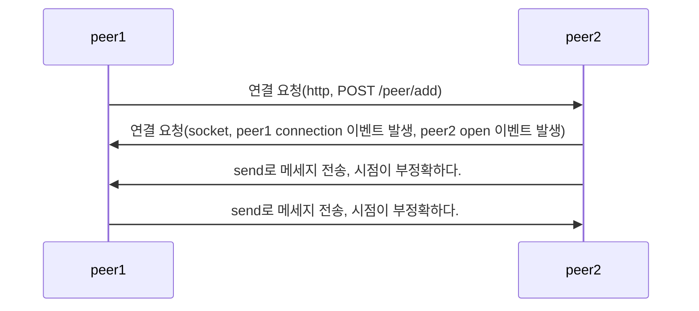

# P2P

- 소켓 통신을 사용해서 Peer To Peer를 구현한다.

# 연결 방법

# socket.io VS ws(WebSocket)

- WebSocket : 웹 기반의 소켓 시스템

  - 브라우저와 서버 사이에 소켓 통신을 하기 위한 기술

- socket.io : WebSocket을 기반으로 구현된 라이브러리
  - WebSocket에 비해서 무겁지만 각종 편의 기능을 제공한다.(room)

| WebSocket                  | socket.io                                       |
| -------------------------- | ----------------------------------------------- |
| HTML5 웹 표준 기술         | 표준이 아니다. 단순 라이브러리                  |
| 빠르고 데이터 사용이 적다. | 느리지만 연결이 끊겼을 시 계속 연결을 시도한다. |
| 단순히 전송만 한다.        | 방, 연결 실패 시 지속 연결 등 기능을 제공한다.  |

- 블록체인에서 방 필요 없고 계속 연결 확인할 필요 없으니 WebSocket을 사용한다.
