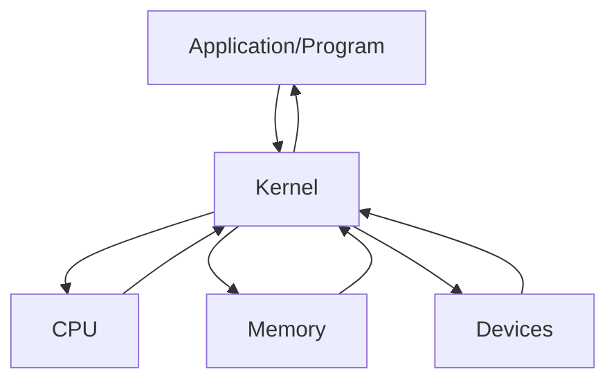

# VM

- Virtual Machine의 약자
- OS 내에서 다른 OS를 설치, 실행하는 프로그램
- LPPlayer 등을 포함하는 안드로이드 플레이어, Java에서 사용하는 JVM, Ethereum에서 사용하는 EVM, Windows/Linux/Android 등 거의 모든 OS를 설치할 수 있는 VMWare 등
- 단점으로는 물리적인 컴퓨터, 즉 하드웨어의 성능을 본래의 OS와 나누게 된다. => 성능 저하를 일으킨다.

# Kernel

- 커널이란 하드웨어와 프로그램을 연결해주는 프로그램이다.
- 운영체제(OS)에 포함되어있다.



# WSL

- Windows SubSystem for Linux
- 윈도우에서 Linux OS를 사용하게 해주는 서비스
- Linux OS에는 Ubuntu, cent OS, Redhat 등이 있다.
  - Linux는 Unix 기반의 OS이다.
  - Mac OS도 Unix 기반의 OS이다.
- WSL은 VM과 조금은 다르다. => VM이 OS 상에서 다른 OS를 설치, 사용 => VM은 하드웨어 성능을 나눠서 사용하지만 WSL은 Linux의 기반을 설치하지 않고 Windows의 기반을 사용하여 Linux를 실행한다.
  - Linux의 커널을 사용하지 않는다.
  - 성능 저하가 그렇게 크지 않다.
  - 예전에는 OS 충돌이 있었으나 많은 패치로 요즘은 상당히 적어진 상태

# 설치

- 기초 확인 사항
  1. 윈도우 버전이 20H1 이상일 때 사용 가능

1. 제어판 -> 프로그램 제거 -> 왼쪽에 Windows 기능 켜기/끄기
   - Linux용 Windows 하위 시스템
2. Microsoft Store에서 terminal 설치
   - PowerShell과 같은 걸로 나온다.
   - WSL 사용에 있어서 terminal을 권장
3. terminal에서 아래의 명령어를 입력
   ```sh
   dism.exe /online /enable-feature /featurename:Microsoft-Windows-Subsystem-Linux /all /norestart
   ```
   - 배포 이미지 관리
   ```sh
   dism.exe /online /enable-feature /featurename:VirtualMachinePlatform /all /norestart
   ```
   - 가상 머신 활성화
4. 아래의 명령어로 설치 가능한 Linux OS를 확인할 수 있다.

```sh
wsl --list --online
```

5. 우분투 설치

```sh
wsl --install -d Ubuntu
```

6. Enter new Unix username

- 사용자 이름 입력

7. WSL2를 사용하기 위해 아래 프로그램 설치
   https://learn.microsoft.com/ko-kr/windows/wsl/install-manual#step-4---download-the-linux-kernel-update-package
