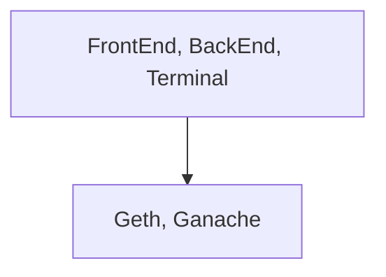
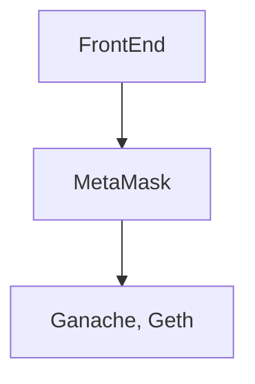
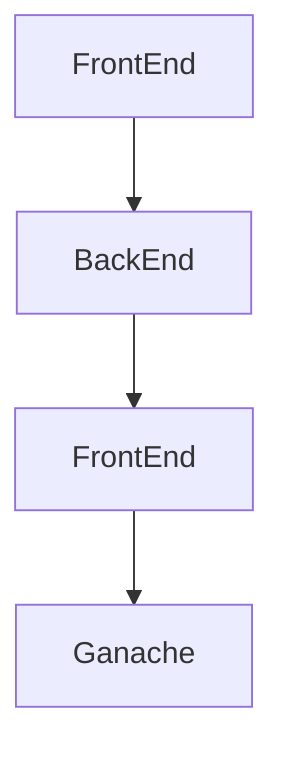
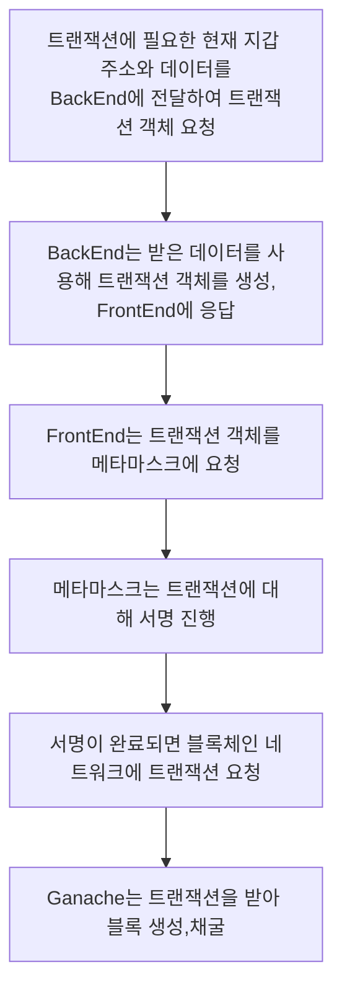

# BlockChain Network

## Geth

- 블록체인 네트워크 서버
- Genesis 블록부터 설정 가능
- IPC를 사용하여 접근 가능
- RPC를 설정하여 메서드 사용 가능
- 다른 피어와 동기화 가능
  - Chain ID로 같은 블록체인 네트워크인지 확인
- attach 명령어로 블록체인 네트워크에 접근 가능

## Ganache

- 테스트가 바로 가능할 정도로 블록체인 네트워크 생성이 자동화 되어있음
- 다른 피어를 찾지 않음
  - 같은 블록체인 네트워크여도 동기화 하지 않음
- 자동 채굴
  - 트랜잭션을 받으면 즉각적인 적용이 가능
- 기본적으로 모든 내부 지갑 계정이 unlock 되어있음

# 트랜잭션 보내기

## Geth attach 명령어를 사용하여 블록체인 네트워크에 접근

- IPC 또는 HTTP, WS 등 블록체인 네트워크에 직접 접근(접속)하여 RPC를 사용
- 블록체인 네트워크 내에서 트랜잭션을 바로 추가

```bash
geth attach http://localhost:8545
eth.sendTransaction({from:eth.accounts[0], to:eth.accounts[1], value:web3.toWei(1, 'ether')})
```

## CURL 명령어를 사용하여 API 요청

- Windows CMD|PowerShell 등에서 CURL 명령어를 사용
- RPC와 유사하지만 중첩되서 사용할 수 없다.
  - 위에서는 eth.sendTransaction과 eth.accounts를 한 줄(한번)에 사용 가능하지만 아래에서는 불가능

```bash
curl -X POST -H "content-type: application/json" --data '{"id": 1337, "jsonrpc": "2.0", "method": "eth_sendTransaction", "params": [{"from": "0x....", "to": "0x....", "value": "0x...."}]}' http://localhost:8545
```

## AXIOS 라이브러리를 사용하여 API 요청

- HTML, React 등에서 사용하는 방법
- curl과 유사

```js
axios.post("http://localhost:8545", {
  id: 1337,
  jsonrpc: "2.0",
  method: "eth_sendTransaction",
  params: [
    {
      from: "0x....",
      to: "0x....",
      value: "0x....",
    },
  ],
});
```

## Web3를 사용

- 블록체인 네트워크에 맞게 구현된 라이브러리

```js
web3.eth.sendTransaction({ from: "0x....", to: "0x....", value: "0x...." });
```

# 트랜잭션을 보내는 방식

## 블록체인 네트워크에 바로 접근



- Geth attach

## MetaMask를 사용하여 접근



```js
const web3 = new Web3(window.ethereum);
```

## BackEnd 서버를 사용





- 스마트 컨트렉트 데이터를 숨길 수 있다.
