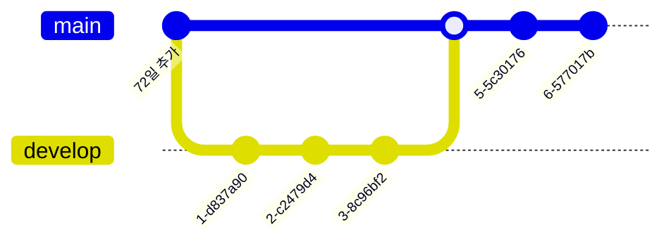
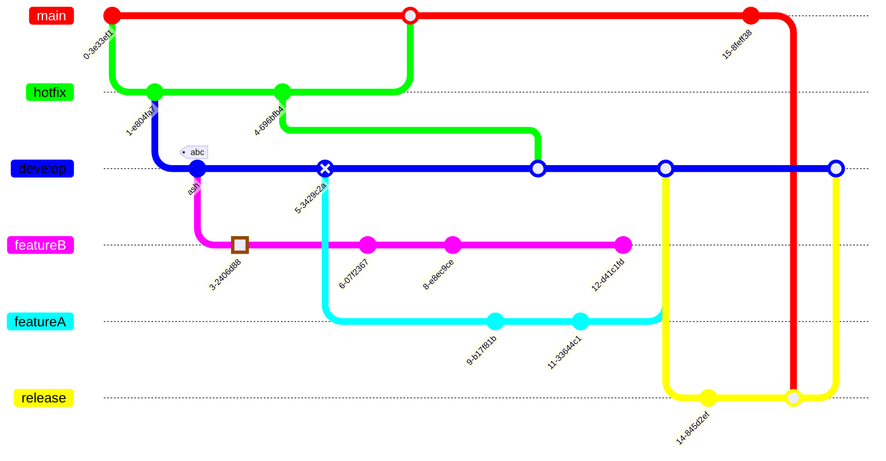

작업 내용에 대해서 타임라인으로 전부 기록해야한다.

회의록 남겨야한다.

참고사항 : WBS

# h1을 출력한다.

## h2을 출력한다.

### h3을 출력한다.

#### h4을 출력한다.

##### h5을 출력한다.

###### h6을 출력한다.

    탭을 이용해서 들여쓰기를 하면 회색으로 뭉쳐진다?

```
이래도 하나로 뭉쳐진다. 탬플릿 리터럴 3개
```

```javascript
const temp = "javascript를 출력할 수 있다";
```

1. 순서있다
2. 순서있다
3. 순서있다

- 순서 없다
  - 확인중
- 순서 없다
- 순서 없다

---

3개여도 되네...

</img>






